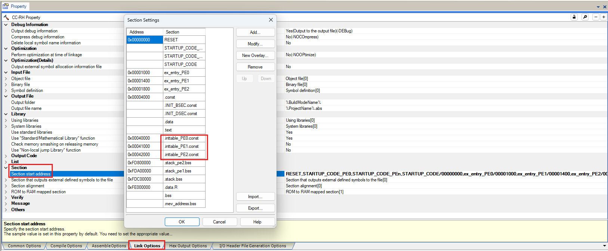
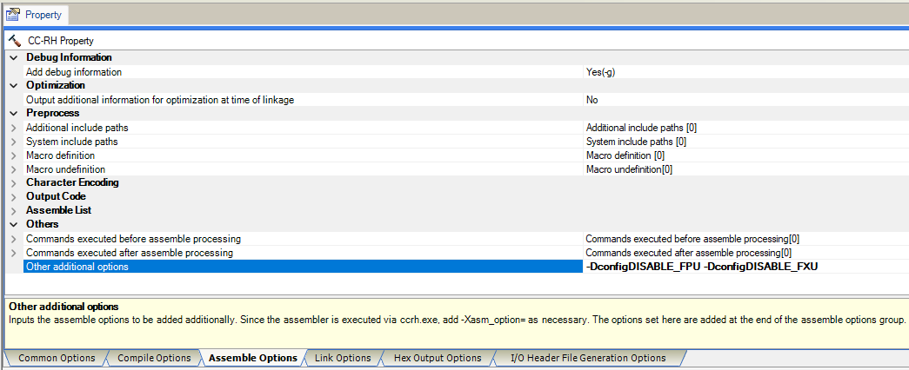

# RH850/U2x FreeRTOS Port with CC-RH Compiler

## Introduction

This repository contains the port of FreeRTOS for Renesas RH850/U2x microcontrollers using the CC-RH compiler. The following sections provide instructions on how to use this port, a link to the test project, and other relevant information.

## Prerequisites
- Compiler: CC-RH
- FreeRTOS version 11.2.0

| Device   | FPU | FXU | SMP |
|----------|-----|-----|-----|
| U2A6     | Yes | No  | Yes |
| U2A8     | Yes | No  | Yes |
| U2A16    | Yes | No  | Yes |
| U2B6     | Yes | Yes | Yes |
| U2B10    | Yes | Yes | Yes |

## Link to Test Project

The test project can be found in [RH850_U2Ax_CCRH](https://github.com/FreeRTOS/FreeRTOS-Partner-Supported-Demos/tree/main/RH850_U2Ax_CCRH) and [RH850_U2Bx_CCRH](https://github.com/FreeRTOS/FreeRTOS-Partner-Supported-Demos/tree/main/RH850_U2Bx_CCRH). These projects contain example tasks and configurations to help you get started with FreeRTOS on the RH850/U2Ax and RH850/U2Bx.

## Setup for Vector Table
   1. Allocate the Stack area in Linker Script: 
    - In the Linker configuration, create a dedicated Stack (memory region) for the Vector Table of each Processing Element (PE).

      For example, in **Section Settings**, add: 
      | Address    | Section             |
      |------------|---------------------|
      | 0x00040000 | .inttable_PE0.const |
      | 0x00041000 | .inttable_PE1.const |
      | 0x00042000 | .inttable_PE2.const |

      

   2. Declare the Vector Table in the source code: 
    - In the application source code, define the Vector Table. 
    - Map this Vector Table to the Stack region that was created in the Linker Script.

      For example, in **main.c** file, add: 
      <pre>
      /***********************************************************************************************************************
       * Vector Table Configuration
       **********************************************************************************************************************/
      /* Interrupt vector table for PE0. Mapping into the memory section ".inttable_PE0". */
      #pragma section const ".inttable_PE0"
      const int_vector_t g_vector_table_PE0[ RTOS_VECTOR_TABLE_MAX_ENTRIES ] =
      {
          #if ( configNUMBER_OF_CORES > 1 )
              [ 1 ] = vPortIPIHander,              /* Internal processor interrupt 1 */
          #endif /* End of #if (configNUMBER_OF_CORES > 1) */

          [ 360 ] = vPortTickISR,                  /* INTOSTM0TINT (OSTM0 interrupt) */
          [ 621 ] = r_Config_UART0_interrupt_send, /* EIC621: INTRLIN30UR0 (RLIN30 transmit interrupt) */
      };

      #if ( configNUMBER_OF_CORES > 1 )
          /* Interrupt vector table for PE1. Mapping into the memory section ".inttable_PE1". */
          #pragma section const ".inttable_PE1"
          const int_vector_t g_vector_table_PE1[ RTOS_VECTOR_TABLE_MAX_ENTRIES ] =
          {
              [ 1 ] = vPortIPIHander,            /* Internal processor interrupt 1 */
          };

          /* Interrupt vector table for PE2. Mapping into the memory section ".inttable_PE2". */
          #pragma section const ".inttable_PE2"
          const int_vector_t g_vector_table_PE2[ RTOS_VECTOR_TABLE_MAX_ENTRIES ] =
          {
              [ 1 ] = vPortIPIHander,            /* Internal processor interrupt 1 */
          };
      #endif /* End of #if (configNUMBER_OF_CORES > 1) */

      #pragma section default
      </pre>

   3. Assign the Vector Table into the INTBP register in Startup: 
    - In System Startup, assign the Vector Table address into the INTBP register so that the Processor knows where to fetch Interrupt Vectors.

      For example, in **Startup** file, add: 
      <pre>
      $ifdef PE1_USED
      __PE1:
          ; Initialization of the interrupt base pointer.
          .extern  _g_vector_table_PE1
          mov      #_g_vector_table_PE1, r10
          ldsr     r10, 4, 1 ; INTBP

          mov      #_PE1_stacktop, sp     ; Set sp register.
          mov      #__sex_entry_PE1, r10  ; First set EBASE register address.
          jr32     __DONE
      $endif

      $ifdef PE2_USED
      __PE2:
          ; Initialization of the interrupt base pointer.
          .extern  _g_vector_table_PE2
          mov      #_g_vector_table_PE2, r10
          ldsr     r10, 4, 1 ; INTBP

          mov      #_PE2_stacktop, sp     ; Set sp register.
          mov      #__sex_entry_PE2, r10  ; First set EBASE register address.
          jr32     __DONE
      $endif
      </pre>

   4. Interrupt Vector Configuration: 
    - Interrupt handling must be configured using the Direct Vector method, e.g. by configuring EBASE or EICn registers.

## FPU and FXU Units Usage
   - The `FXU Unit` is available only on RH850 U2Bx devices. 
     To ensure correct operation, any task requiring FXU must run on an FXU-enabled core. In SMP systems, the core assignment shall be fixed using CPU affinity via the `vTaskCoreAffinitySet()` function.

   - By default, the FPU and FXU operations are enabled, which may introduce redundant code and impact performance. 
     If they are not required by the application, FPU and FXU related code can be disabled by defining the macros `configDISABLE_FPU` and `configDISABLE_FXU` respectively. 
     Additionally, `-DconfigDISABLE_FPU` and `-DconfigDISABLE_FXU` should be added to the compiler option.

     For example, in **Property** of CC-RH (Build Tool): 
     

## Note
   1. Refer this formula to estimate the minimal stack size (configMINIMAL_STACK_SIZE) used: `[(task_context_size) * 2] + stack_required_for_taskcode`. 
      In which, `task_context_size` is calculated as `36 * 4 bytes = 144 bytes`.

   2. Users need to create a memory section named `mev_address` in `CRAM` for Exclusive Control functionality. Users should initialize the `mev_address` section in the startup file.

        For example: 
        <pre>
        ; .mev_address section in CRAM is used for Sync flags
        mov     #__s.mev_address.bss, r20
        st.w    r0, 0[r20]</pre>

   3. This port supports both U2Ax and U2Bx devices. The User must configure `configDEVICE_NAME` with the value `U2Bx_DEVICES` or `U2Ax_DEVICES` to specify which device is being used.

   4. This port also supports the configuration of contiguous CPU cores in FreeRTOS SMP, allowing the User to set task affinity for execution on specific cores or subsets of cores.

## Other Relevant Information

- **Documentation:**
  - Refer to the official [FreeRTOS documentation](https://www.freertos.org/Documentation/RTOS_book.html) for detailed information on configuring and using FreeRTOS.
  - Consult the [RH850 U2A group user manual hardware manual](https://www.renesas.com/en/document/mah/rh850u2a-eva-group-users-manual-hardware-0?r=1546621) for specific details about the microcontroller.
  - Consult the [RH850 U2B group user manual hardware manual](https://www.renesas.com/en/document/mah/rh850u2b-hardware-users-manual-rev-120-r01uh0923ej0120?r=1539266) for specific details about the microcontroller.
  - For more information about Renesas RH850 microcontrolers, please visit [this website](https://www.renesas.com/us/en/products/microcontrollers-microprocessors/rh850-automotive-mcus)
  - The CC-RH compiler can be downloaded [here](https://www.renesas.com/us/en/software-tool/c-compiler-package-rh850-family#downloads)

- **Support:**
  - If you encounter any issues or have questions about this port, please open an issue in this repository or contact the maintainer.

- **Contributing:**
  - Contributions to improve this port are welcome. Please fork the repository, make your changes, and submit a pull request.
